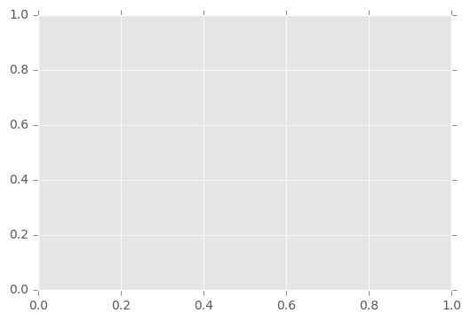
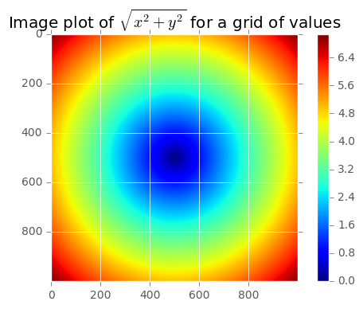
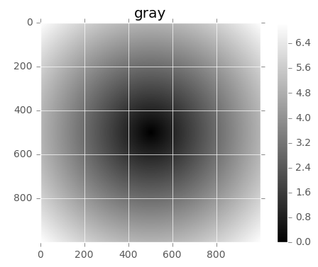

## This is my first jupyter notes

### Di sanceng biaoti


```python
1+2
```


    3


```python
def f(x,y,z):
    return (x+y)/z
a = 5

b=6

c=7.5
```


```python
import numpy as np

data = np.random.rand(2,11)
print(data)


```

    [[ 0.67577294  0.194396    0.5525098   0.04609985  0.14534381  0.93533033
       0.32043392  0.0807357   0.46490533  0.89414549  0.260932  ]
     [ 0.78801884  0.25585532  0.99597803  0.09019288  0.58768134  0.0815639
       0.18691377  0.60306836  0.80131033  0.63986103  0.2780275 ]]
    


```python
type(data), data.shape
```


    (numpy.ndarray, (2, 11))


```python
data.dtype
```


    dtype('float64')


```python
data.dtype
```


    dtype('float64')


## second part


```python
data1 = [23,3,4.45,5,3,5,0]
    
```


```python
arr1 = np.array(data1)
```


```python
arr1
```


    array([ 23.  ,   3.  ,   4.45,   5.  ,   3.  ,   5.  ,   0.  ])


```python
arr1.shape
arr1.reshape(1,7)

arr1.shape
```


    (7,)


```python
arr1.dtype
```


    dtype('float64')


```python
np.zeros(10)
```


    array([ 0.,  0.,  0.,  0.,  0.,  0.,  0.,  0.,  0.,  0.])


```python
np.zeros((3,4))
```


    array([[ 0.,  0.,  0.,  0.],
           [ 0.,  0.,  0.,  0.],
           [ 0.,  0.,  0.,  0.]])


```python
a = _
```


```python
a.shape
```


    (3, 4)


```python
np.empty((2,3))
```


    array([[ 23.  ,   3.  ,   4.45],
           [  5.  ,   3.  ,   5.  ]])


```python

np.empty((3,4,5))
```


    array([[[  1.00999541e-311,   1.00997906e-311,   1.00997961e-311,
               1.00997851e-311,   1.00997844e-311],
            [  1.00997838e-311,   1.00997751e-311,   1.00997963e-311,
               1.00997838e-311,   1.00997751e-311],
            [  1.00997768e-311,   1.00997961e-311,   1.00997758e-311,
               1.00997758e-311,   1.00997768e-311],
            [  1.00997758e-311,   1.00997967e-311,   1.00997939e-311,
               1.00997961e-311,   1.00997751e-311]],
    
           [[  1.00997846e-311,   1.00997865e-311,   1.00997766e-311,
               1.00997838e-311,   1.00997751e-311],
            [  1.00997768e-311,   1.00997865e-311,   1.00997852e-311,
               1.00997838e-311,   1.00997758e-311],
            [  1.00997758e-311,   1.00997838e-311,   1.00997852e-311,
               1.00997865e-311,   1.00997766e-311],
            [  1.00997766e-311,   1.00997865e-311,   1.00997766e-311,
               1.00997768e-311,   1.00997766e-311]],
    
           [[  1.00997865e-311,   1.00997768e-311,   1.00997768e-311,
               1.00997749e-311,   1.00997766e-311],
            [  1.00997766e-311,   1.00997768e-311,   1.00997768e-311,
               1.00997963e-311,   1.00997963e-311],
            [  1.00997963e-311,   9.21088093e-315,   1.00997964e-311,
               9.21088710e-315,   1.00997964e-311],
            [  9.21088093e-315,   9.21088093e-315,   1.00997962e-311,
               1.00997963e-311,   9.21088093e-315]]])


```python
    a = _

print(a.shape)

print(a)
```

    (3, 4, 5)
    [[[  1.00999541e-311   1.00997906e-311   1.00997961e-311   1.00997851e-311
         1.00997844e-311]
      [  1.00997838e-311   1.00997751e-311   1.00997963e-311   1.00997838e-311
         1.00997751e-311]
      [  1.00997768e-311   1.00997961e-311   1.00997758e-311   1.00997758e-311
         1.00997768e-311]
      [  1.00997758e-311   1.00997967e-311   1.00997939e-311   1.00997961e-311
         1.00997751e-311]]
    
     [[  1.00997846e-311   1.00997865e-311   1.00997766e-311   1.00997838e-311
         1.00997751e-311]
      [  1.00997768e-311   1.00997865e-311   1.00997852e-311   1.00997838e-311
         1.00997758e-311]
      [  1.00997758e-311   1.00997838e-311   1.00997852e-311   1.00997865e-311
         1.00997766e-311]
      [  1.00997766e-311   1.00997865e-311   1.00997766e-311   1.00997768e-311
         1.00997766e-311]]
    
     [[  1.00997865e-311   1.00997768e-311   1.00997768e-311   1.00997749e-311
         1.00997766e-311]
      [  1.00997766e-311   1.00997768e-311   1.00997768e-311   1.00997963e-311
         1.00997963e-311]
      [  1.00997963e-311   9.21088093e-315   1.00997964e-311   9.21088710e-315
         1.00997964e-311]
      [  9.21088093e-315   9.21088093e-315   1.00997962e-311   1.00997963e-311
         9.21088093e-315]]]
    


```python
    np.arange(21)
```


    array([ 0,  1,  2,  3,  4,  5,  6,  7,  8,  9, 10, 11, 12, 13, 14, 15, 16,
           17, 18, 19, 20])


```python
np.arange(21)
```


    array([ 0,  1,  2,  3,  4,  5,  6,  7,  8,  9, 10, 11, 12, 13, 14, 15, 16,
           17, 18, 19, 20])


array: 将数据转化成ndarray

asarray：将数据转换成ndarray

arange：产生的是一个ndarray，而array产生的是list


```python
arr1 = np.arange(12, dtype=np.float64)

print(arr1)
```

    [  0.   1.   2.   3.   4.   5.   6.   7.   8.   9.  10.  11.]
    


```python
print(arr1.dtype)
type(arr1)
```

    float64
    


    numpy.ndarray


```python
np.arange(12,dtype=np.float64)
```


    array([  0.,   1.,   2.,   3.,   4.,   5.,   6.,   7.,   8.,   9.,  10.,
            11.])


```python
np.eye(5)
```


    array([[ 1.,  0.,  0.,  0.,  0.],
           [ 0.,  1.,  0.,  0.,  0.],
           [ 0.,  0.,  1.,  0.,  0.],
           [ 0.,  0.,  0.,  1.,  0.],
           [ 0.,  0.,  0.,  0.,  1.]])


向量化的数组运算比纯python同等程度的运算要快很多。

一个简单的例子，假设我们想要评价函数sqrt(x^2 + y^2)

np.meshgrid函数取两个1维的数组，产生一个2位的矩阵，对应于所有两个数组中(x, y)的组合：


```python
import numpy as np
```


在进行书中的内容之前，先举个例子说明meshgrid的效果。meshgrid函数用两个坐标轴上的点在平面上画网格。

用法：
- [X,Y]=meshgrid(x,y)
- [X,Y]=meshgrid(x)与[X,Y]=meshgrid(x,x)是等同的
- [X,Y,Z]=meshgrid(x,y,z)生成三维数组，可用来计算三变量的函数和绘制三维立体图


这里，主要
以

- [X,Y]=meshgrid(x,y)为例，来对该函数进行介绍。
- [X,Y] = meshgrid(x,y) 将向量x和y定义的区域转换成矩阵X和Y,其中矩阵X的行向量是向量x的简单复制，而矩阵Y的列向量是向量y的简单复制(注：下面代码中X和Y均是数组，在文中统一称为矩阵了)。


假设x是长度为m的向量，y是长度为n的向量，则最终生成的矩阵X和Y的维度都是 nm （注意不是mn）。


```python

m,n = (5,3)

x = np.linspace(0,1,m)

y = np.linspace(0,1,n)

X,Y = np.meshgrid(x,y)

x
```


    array([ 0.  ,  0.25,  0.5 ,  0.75,  1.  ])


```python
y
```


    array([ 0. ,  0.5,  1. ])


```python
x
```


    array([ 0.  ,  0.25,  0.5 ,  0.75,  1.  ])


```python
X
```


    array([[ 0.  ,  0.25,  0.5 ,  0.75,  1.  ],
           [ 0.  ,  0.25,  0.5 ,  0.75,  1.  ],
           [ 0.  ,  0.25,  0.5 ,  0.75,  1.  ]])


```python

X.shape
```


    (3, 5)


```python

Y
```


    array([[ 0. ,  0. ,  0. ,  0. ,  0. ],
           [ 0.5,  0.5,  0.5,  0.5,  0.5],
           [ 1. ,  1. ,  1. ,  1. ,  1. ]])


```python

```


```python

import matplotlib.pyplot as plt   
%matplotlib inline
plt.style.use('ggplot')

plt.plot(X,Y, maker='*', color='blue', linestyle='none')
```


    ------------------------------------------------------------------------

    AttributeError                         Traceback (most recent call last)

    <ipython-input-74-2621aaa0e2ee> in <module>()
          4 plt.style.use('ggplot')
          5 
    ----> 6 plt.plot(X,Y, maker='*', color='blue', linestyle='none')
    

    C:\Anaconda3\lib\site-packages\matplotlib\pyplot.py in plot(*args, **kwargs)
       3159         ax.hold(hold)
       3160     try:
    -> 3161         ret = ax.plot(*args, **kwargs)
       3162     finally:
       3163         ax.hold(washold)
    

    C:\Anaconda3\lib\site-packages\matplotlib\__init__.py in inner(ax, *args, **kwargs)
       1816                     warnings.warn(msg % (label_namer, func.__name__),
       1817                                   RuntimeWarning, stacklevel=2)
    -> 1818             return func(ax, *args, **kwargs)
       1819         pre_doc = inner.__doc__
       1820         if pre_doc is None:
    

    C:\Anaconda3\lib\site-packages\matplotlib\axes\_axes.py in plot(self, *args, **kwargs)
       1380         kwargs = cbook.normalize_kwargs(kwargs, _alias_map)
       1381 
    -> 1382         for line in self._get_lines(*args, **kwargs):
       1383             self.add_line(line)
       1384             lines.append(line)
    

    C:\Anaconda3\lib\site-packages\matplotlib\axes\_base.py in _grab_next_args(self, *args, **kwargs)
        379                 return
        380             if len(remaining) <= 3:
    --> 381                 for seg in self._plot_args(remaining, kwargs):
        382                     yield seg
        383                 return
    

    C:\Anaconda3\lib\site-packages\matplotlib\axes\_base.py in _plot_args(self, tup, kwargs)
        367         ncx, ncy = x.shape[1], y.shape[1]
        368         for j in xrange(max(ncx, ncy)):
    --> 369             seg = func(x[:, j % ncx], y[:, j % ncy], kw, kwargs)
        370             ret.append(seg)
        371         return ret
    

    C:\Anaconda3\lib\site-packages\matplotlib\axes\_base.py in _makeline(self, x, y, kw, kwargs)
        274         default_dict = self._getdefaults(None, kw)
        275         self._setdefaults(default_dict, kw)
    --> 276         seg = mlines.Line2D(x, y, **kw)
        277         return seg
        278 
    

    C:\Anaconda3\lib\site-packages\matplotlib\lines.py in __init__(self, xdata, ydata, linewidth, linestyle, color, marker, markersize, markeredgewidth, markeredgecolor, markerfacecolor, markerfacecoloralt, fillstyle, antialiased, dash_capstyle, solid_capstyle, dash_joinstyle, solid_joinstyle, pickradius, drawstyle, markevery, **kwargs)
        378         # update kwargs before updating data to give the caller a
        379         # chance to init axes (and hence unit support)
    --> 380         self.update(kwargs)
        381         self.pickradius = pickradius
        382         self.ind_offset = 0
    

    C:\Anaconda3\lib\site-packages\matplotlib\artist.py in update(self, props)
        857                 func = getattr(self, 'set_' + k, None)
        858                 if func is None or not six.callable(func):
    --> 859                     raise AttributeError('Unknown property %s' % k)
        860                 func(v)
        861             changed = True
    

    AttributeError: Unknown property maker





```python
z = [i for i in zip(X.flat, Y.flat)]

z

len(z)
```


    15


```python
points = np.arange(-5,5,0.01)
```


```python
points = np.arange(-5,5,0.01)

xs,ys = np.meshgrid(points, points)

xs,ys
```


    (array([[-5.  , -4.99, -4.98, ...,  4.97,  4.98,  4.99],
            [-5.  , -4.99, -4.98, ...,  4.97,  4.98,  4.99],
            [-5.  , -4.99, -4.98, ...,  4.97,  4.98,  4.99],
            ..., 
            [-5.  , -4.99, -4.98, ...,  4.97,  4.98,  4.99],
            [-5.  , -4.99, -4.98, ...,  4.97,  4.98,  4.99],
            [-5.  , -4.99, -4.98, ...,  4.97,  4.98,  4.99]]),
     array([[-5.  , -5.  , -5.  , ..., -5.  , -5.  , -5.  ],
            [-4.99, -4.99, -4.99, ..., -4.99, -4.99, -4.99],
            [-4.98, -4.98, -4.98, ..., -4.98, -4.98, -4.98],
            ..., 
            [ 4.97,  4.97,  4.97, ...,  4.97,  4.97,  4.97],
            [ 4.98,  4.98,  4.98, ...,  4.98,  4.98,  4.98],
            [ 4.99,  4.99,  4.99, ...,  4.99,  4.99,  4.99]]))


```python

z = np.sqrt(xs ** 2 + ys ** 2)

z
```


    array([[ 7.07106781,  7.06400028,  7.05693985, ...,  7.04988652,
             7.05693985,  7.06400028],
           [ 7.06400028,  7.05692568,  7.04985815, ...,  7.04279774,
             7.04985815,  7.05692568],
           [ 7.05693985,  7.04985815,  7.04278354, ...,  7.03571603,
             7.04278354,  7.04985815],
           ..., 
           [ 7.04988652,  7.04279774,  7.03571603, ...,  7.0286414 ,
             7.03571603,  7.04279774],
           [ 7.05693985,  7.04985815,  7.04278354, ...,  7.03571603,
             7.04278354,  7.04985815],
           [ 7.06400028,  7.05692568,  7.04985815, ...,  7.04279774,
             7.04985815,  7.05692568]])


```python

plt.imshow(z);plt.colorbar()


plt.title("Image plot of $\sqrt{x^2+y^2}$ for a grid of values")


```


    <matplotlib.text.Text at 0x1dbfb43e7f0>





```python
plt.imshow(z,cmap=plt.cm.gray); plt.colorbar()

plt.title("gray")
```


    <matplotlib.text.Text at 0x1db84940390>





```python
xarr = np.arange(10)
yarr = np.arange(10, 20)
cond = np.array([True,False, True,False,False, True,False,False, True, True])            
                     
```


np.where中第二个和第三个参数不用必须是数组。

where在数据分析中一个典型的用法是基于一个数组，产生一个新的数组值。假设我们有一个随机数字生成的矩阵，我们想要把所有的正数变为2，所有的负数变为-2。


用where的话会非常简单：


```python
result = [x if c else y for x,y,c in zip(xarr,yarr,cond)]
    
result

```


    [0, 11, 2, 13, 14, 5, 16, 17, 8, 9]


```python
result = np.where(cond, xarr, yarr)

result
```


    array([ 0, 11,  2, 13, 14,  5, 16, 17,  8,  9])


假设我们有一个随机数字生成的矩阵，我们想要把所有的正数变为2，所有的负数变为-2。


用where的话会非常简单


```python

arr = np.random.randn(4,4)

arr
```


    array([[-1.7249151 ,  0.47436864,  1.25594568, -0.50147823],
           [ 0.32329558,  0.70147251, -0.84606626, -0.81102393],
           [ 0.56334907, -0.87781646, -1.29420612, -0.882093  ],
           [-2.05570648, -0.60100428, -0.43001513, -0.18520691]])


```python
arr>0
```


    array([[False,  True,  True, False],
           [ True,  True, False, False],
           [ True, False, False, False],
           [False, False, False, False]], dtype=bool)


```python
np.where(arr>0, 2,-2)
```


    array([[-2,  2,  2, -2],
           [ 2,  2, -2, -2],
           [ 2, -2, -2, -2],
           [-2, -2, -2, -2]])


```python

np.where(arr>0, 2, arr)
```


    array([[-1.7249151 ,  2.        ,  2.        , -0.50147823],
           [ 2.        ,  2.        , -0.84606626, -0.81102393],
           [ 2.        , -0.87781646, -1.29420612, -0.882093  ],
           [-2.05570648, -0.60100428, -0.43001513, -0.18520691]])


```python
np.where(arr>0, -2, 2)
```


    array([[ 2, -2, -2,  2],
           [-2, -2,  2,  2],
           [-2,  2,  2,  2],
           [ 2,  2,  2,  2]])


# 数学和统计方法

一些能计算统计值的数学函数能基于整个数组，或者沿着一个轴，可以使用aggregatios 降维，  比如sum,mean, and std。

下面是一些aggregate statistics （汇总统计）


```python

arr = np.random.randn(5,4)

arr

```


    array([[-0.69958443, -2.46355531,  0.19856965,  1.29106598],
           [ 0.46347983,  0.33712368, -1.09018919, -0.21548269],
           [ 0.29535286, -1.39083895, -0.09018223, -0.2594519 ],
           [ 0.90665136, -0.44205849, -0.16239346,  0.31531549],
           [ 0.49731548,  1.08907863, -1.52806488, -0.5010424 ]])


```python
arr.mean()
```


    -0.17244454806253073


```python
np.mean(arr)    
```


    -0.17244454806253073


```python
arr.sum()
```


    -3.4488909612506147


```python
arr.mean(axis=1)
```


    array([-0.41837603, -0.12626709, -0.36128006,  0.15437873, -0.11067829])


```python
arr.sum(axis=0)
```


    array([ 1.46321511, -2.87025044, -2.67226011,  0.63040448])


## 我是过度线--------------------------------------


```python
arr = np.array([0,2,3,4,4,5,66])
```


```python
arr.cumsum()
```


    array([ 0,  2,  5,  9, 13, 18, 84], dtype=int32)


### 上面的计算是一个累加的结果，0+2 = 2, 2+3=5...


```python
np.cumsum?
```


```python
arr = np.array([[23,4,4],[3,5,4,],[42,5,3]])
arr
```


    array([[23,  4,  4],
           [ 3,  5,  4],
           [42,  5,  3]])


```python
arr.cumsum(axis=0)
```


    array([[23,  4,  4],
           [26,  9,  8],
           [68, 14, 11]], dtype=int32)


```python
arr.cumsum(axis=1)
```


    array([[23, 27, 31],
           [ 3,  8, 12],
           [42, 47, 50]], dtype=int32)


```python
arr = np.random.randn(100)
(arr>0).sum()
```


    55


###    有其他两个办法，any和all， 对于布尔数组特别有用，any 检测数组中只要有一个Ture就返回，就是Ture, 而all，检测数组中所有都是True,才返回True


```python
bools = np.array([False, False, True,  True])
```


```python
bools.any()
```


    True


```python
bools.all()
```


    False


#     Sorting(排序)


```python

np.random.randn?
```


```python
arr = np.random.randn(6)

arr
```


    array([ 0.3934821 ,  0.95045695,  0.08114809,  0.71009844, -0.58873837,
           -0.39691479])


```python

arr


```


    array([ 0.3934821 ,  0.95045695,  0.08114809,  0.71009844, -0.58873837,
           -0.39691479])


```python
arr.sort()
arr
```


    array([-0.58873837, -0.39691479,  0.08114809,  0.3934821 ,  0.71009844,
            0.95045695])


```python
arr = np.random.randn(5,3)

arr
```


    array([[ 2.09807311,  0.76233307,  0.50202059],
           [-1.72025055, -0.16630714, -1.47464429],
           [ 2.82788532, -1.25434574,  0.97145056],
           [ 0.58417455,  0.51401424, -0.4251397 ],
           [ 0.89538709,  1.15031466, -0.66813715]])


```python
arr.sort()
arr
```


    array([[ 0.50202059,  0.76233307,  2.09807311],
           [-1.72025055, -1.47464429, -0.16630714],
           [-1.25434574,  0.97145056,  2.82788532],
           [-0.4251397 ,  0.51401424,  0.58417455],
           [-0.66813715,  0.89538709,  1.15031466]])


```python
arr.sort(0)

arr

```


    array([[-1.72025055, -1.47464429, -0.16630714],
           [-1.25434574,  0.51401424,  0.58417455],
           [-0.66813715,  0.76233307,  1.15031466],
           [-0.4251397 ,  0.89538709,  2.09807311],
           [ 0.50202059,  0.97145056,  2.82788532]])


```python
    
```


```python
    
```


```python
    
```


```python
    
```
